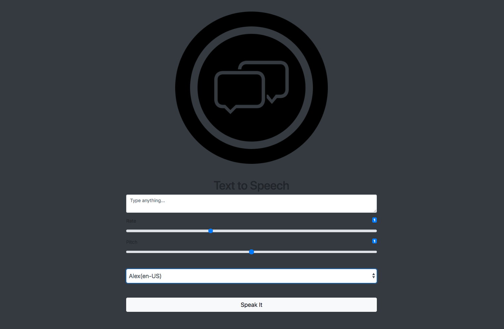

## Text To Speech & Synthesis Application

Uses vanilla JavaScript and the Web Speech API.  

User types text into
a text box, adjusts the rate and pitch, chooses a speech voice, and clicks
a button to hear the text aloud.

